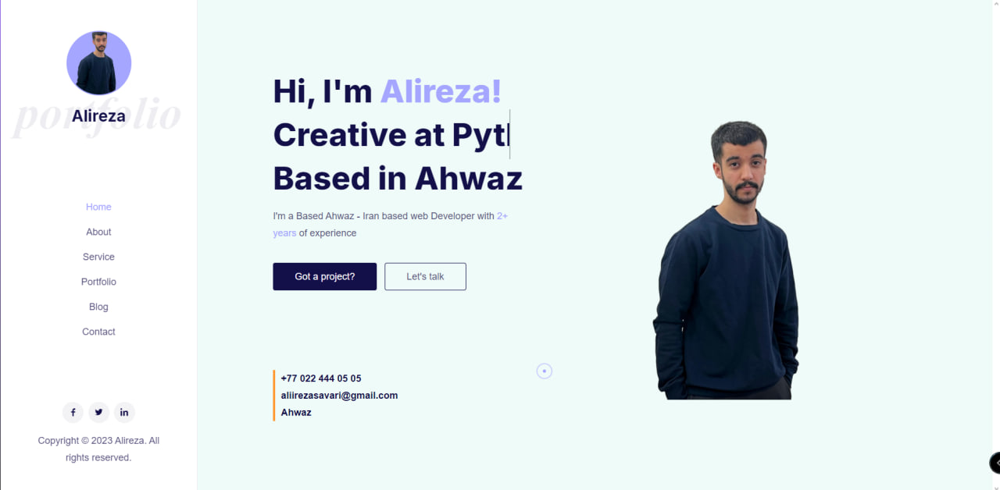
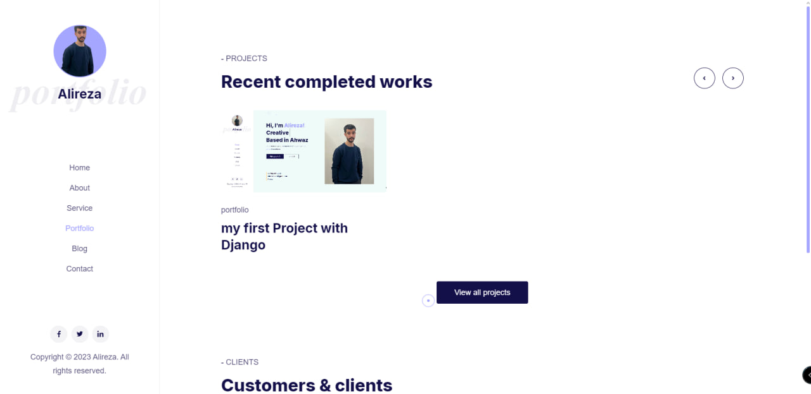
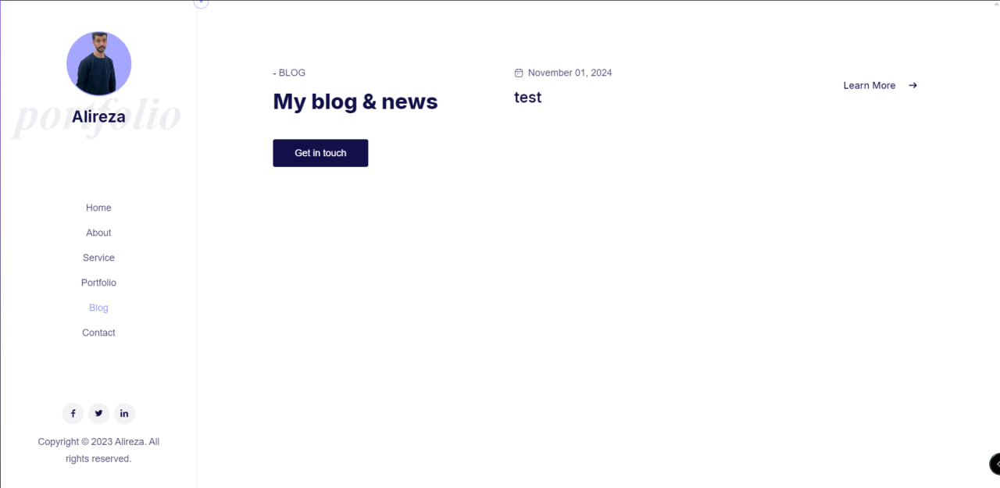
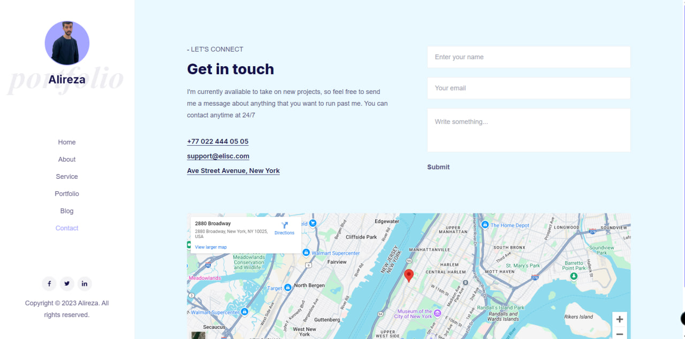
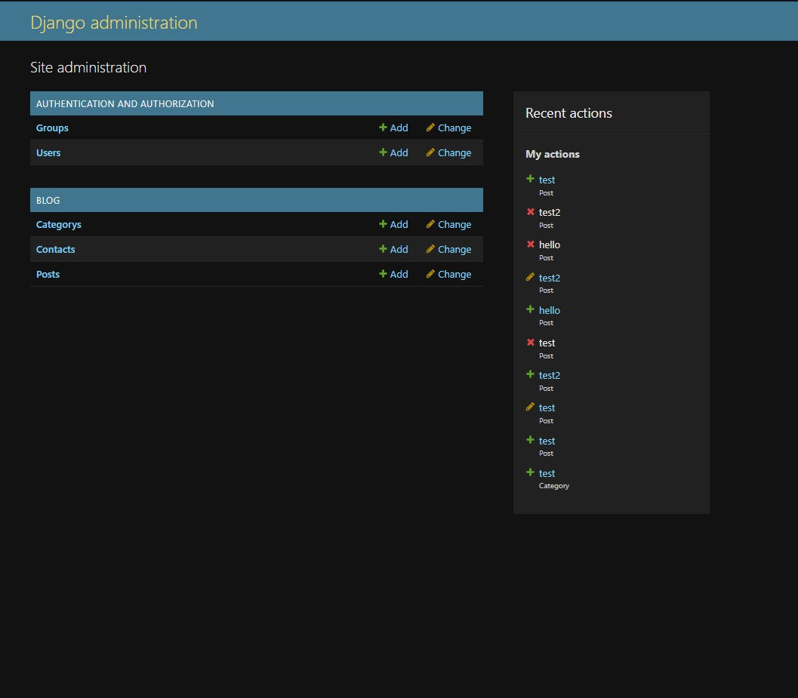

# Personal Portfolio


A personal portfolio website built with Django, showcasing my projects, skills, and professional experience.

## 📸 Project Screenshots

### Home Page

*The landing page featuring a modern, responsive design with personal introduction and highlighted projects.*

### Portfolio Section

*Showcase of various projects with interactive cards and detailed descriptions.*

### Blog Section

*Blog section featuring articles and technical writing.*

### Contact Page

*Contact form with social media integration.*

### Admin Dashboard

*Custom admin interface for content management.*

To add your own screenshots:
1. Create a `screenshots` directory in your project root
2. Add your screenshots to this directory
3. Update the image paths in this README
4. Add descriptive captions for each image

## 🚀 Features

- Responsive design
- Project showcase with detailed descriptions
- Skills section
- Contact form
- Blog/Articles section
- Admin dashboard for content management
- SEO optimized

[Rest of the README remains the same...]

## 🛠️ Technologies Used

- Django 5.x
- Python 3.x
- Sqlite3
- HTML5/tailwind/js
- JavaScript


## ⚙️ Prerequisites

Before you begin, ensure you have the following installed:
- Python 3.8 or higher
- pip (Python package manager)
- Virtual environment (recommended)
- sqlite3 (optional, can use SQLite for development)

## 📦 Installation

1. Clone the repository
```bash
git clone https://github.com/alirezasavari/portfolio.git
cd portfolio
```

2. Create and activate virtual environment
```bash
python -m venv venv
source venv/bin/activate  # On Windows: venv\Scripts\activate
```

3. Install dependencies
```bash
pip install -r requirements.txt
```

4. run make migrations
```bash
python manage.py makemigrations
```

5. Run migrations
```bash
python manage.py migrate
```

6. Create superuser
```bash
python manage.py createsuperuser
```

7. Run development server
```bash
python manage.py runserver
```

The site will be available at `http://127.0.0.1:8000`

## 🚀 Deployment


### Traditional Deployment

1. Set DEBUG=False in settings.py
2. Configure your production database
3. Collect static files:
```bash
python manage.py collectstatic
```

## 📄 License

This project is licensed under the MIT License - see the [LICENSE](LICENSE) file for details.

## 👤 Contact

Your Name - [@yourusername](https://twitter.com/yourusername)

Project Link: [https://github.com/alirezasavari/portfolio](https://github.com/alirezasavari/portfolio)
